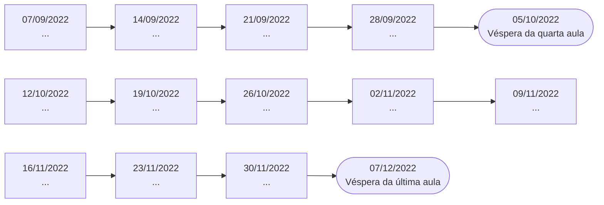

# Timeline do Startup One

## Atividades
- Podemos trabalhar uma proposta de intra-empreendedorismo?
- Um projeto só para o banco?
- Fechar nossos financiadores e usuários (*)
- Apresentação/Pitch
- Trabalho escrito
    - Caracterização do projeto/startup
        - Projeto
        - Mercado alvo
        - Cliente
        - Problema
        - Solução
        - Modelo de negócio
        - Concorrentes
        - Benchmarks
    - Apresentação do projeto/startup
        - Identificação
        - Visão
        - Missão
        - Vetores estratégicos
    - Oportunidade de negócio ou melhoria de processo
    - Análise de mercado
        - Caracterização do mercado alvo
        - Cenário competitivo
        - Concorrência
        - Avaliação do projeto/startup em relação aos principais concorrentes
    - Desenvolvimento do negócio
    - Canvas da proposta de valor (*)
        - Produtos e serviços
        - Criadores de ganhos
        - Aliviadores de dores
        - Tarefas do cliente
        - Ganhos
        - Dores
    - Canvas do modelo de negócio (!)
        - Parceiros chave
        - Atividades chave
        - Recursos chave
        - Estrutura de custos
        - Proposta de valor
        - Relacionamento com o cliente
        - Canais de distribuição
        - Segmentos de clientes
        - Fluxo de receitas
    - Análise da viabilidade econômica e financeira
    - Validação e protótipo
    - Contribuição para a empresa
    - Primeiros passos
    - Bibliografia
